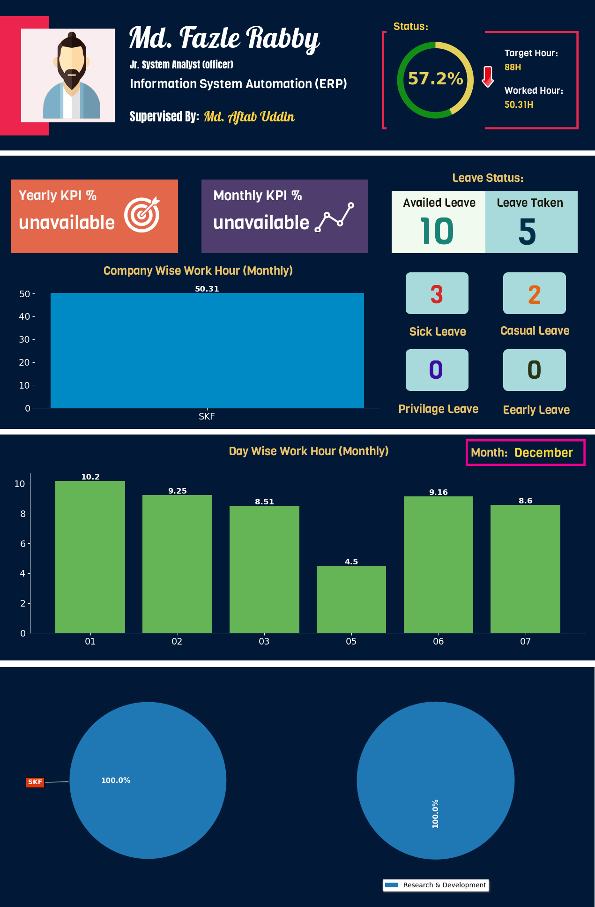

# Employee_Personal_portfolio_generator
This is a project which generates a performance evaluation report of any employee and sends it to their mail address automatically.

This project is developed using python programming language. It uses some famous libraries like Matplotlib, Numpy, Pandas and Pyodbc.
The objective of the project is to generate a monthly performance report based on the live data present in the current database and send it to the employees emails individually.
This program gets executed in the last day of the month by the system automatically, generates report like below and sends it to the respected email.

Test Output:

